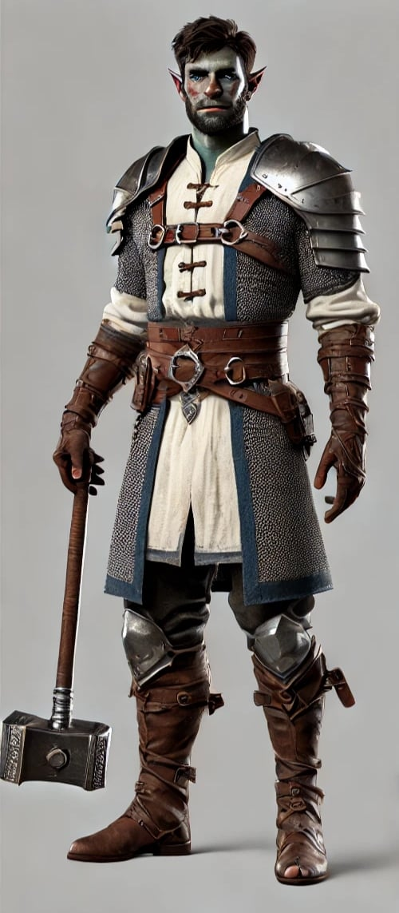

# Thorn Shagar (Rokas)

31 metai.

Thorn (Fornas) yra pusiau orkas klerikas. Jis renka visokius metalus ir tai jį atvedė į [Medininkų](../locations/Medininkai) kaimelį. Forną yra įsimylėjus [Severija](Severija-Magna) tačiau jis tuo pačiu dar neatsako. Pasirodžius įtartinam berniukui, jis buvo drąsiausias, bet taip pat atsargiai artinosi prie jo. Kadangi buvo arčiausiai - jį įtraukė į medį. Iš medžio jį ištraukė [Grimantas](Grimantas-StoneFist). Jam nepatiko vaikžudystė. Nepasitiki [Vėja](Veja-Laume-Vilke), nes ji melavo. Kiek metų?